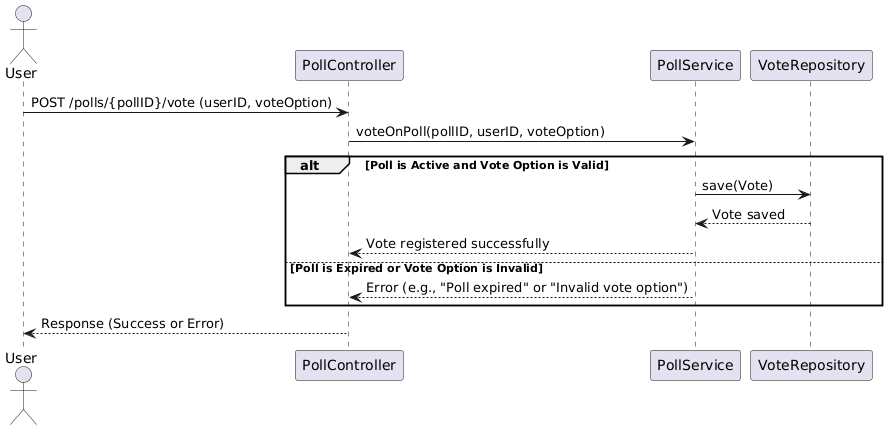

# Welcome to SploinkyBoink

## About

This poll application allows users to create polls, vote on them, and view results. Users can submit a question with multiple answer options, vote for their preferred option, and see the current vote counts displayed in real time. The app consists of a frontend for user interaction and a backend for processing votes and managing poll data in a database.

## Setup 

#### Prerequisites
Ensure you have Docker and Docker Compose installed.

#### Build and Run the Application
In the root of your project, start all services (backend, frontend, and PostgreSQL) using Docker Compose with a single command:

```bash
docker-compose up --build
``` 

This command will:

* Build the Docker images for the backend and frontend.
* Start the PostgreSQL database.
* Expose the backend on port 8080 and the frontend on port 5173.

Once everything is set up, you can access the backend at http://localhost:8080 and the frontend at http://localhost:5173.

#### Useful gradle commands:

Run the application locally:
```bash
./gradlew bootRun
```

Build the project:
```bash
./gradlew build
```

Clean the project to ensure consistency in the build process:
```bash 
./gradlew clean
```

####

## Poll System Business Logic 

The business logic for this application centers around three main entities: **Users**, **Polls**, and **Votes**. Each entity has defined actions within the system, facilitated by the `PollController` and `PollService` classes. The system enforces important constraints to ensure business rules are followed.

#### 1. User Management
- Users can be created, retrieved, and deleted within the system.  
- **Constraints**: A user must exist before creating a poll.

#### 2. Poll Management
- Users can manage polls, including creating, retrieving, and deleting polls.  
- **Constraints**: A poll cannot be modified or deleted if it has expired or is already closed and guest users cannot create polls.  

#### 3. Voting Logic
- Users can vote on a poll by choosing one of the available options.
- Users can modify their existing vote on a poll.
- Users can delete their votes.
- All votes cast in a specific poll can be retrieved. 
- **Constraints**: Users cannot vote or delete or modify their votes on polls that have expired. 

### Sequence diagram 
The sequence diagram shows the interactions involved in voting on a poll. A user either submits a vote successfully or receives an error response. 



#### Voting Process Sequence:
1. User requests to vote on a poll.
2. The `PollController` handles the request and forwards it to the `PollService`.
3. The `PollService` retrieves the `Poll` and validates if the poll exists, the user exists, and the vote option is valid.
4. The vote is recorded if all conditions are met, by adding the vote to the poll and saving it to the pollRepository. 

Here is the plantUML used to create the picture:

```Java
@startuml
actor User
participant "PollController" as PC
participant "PollService" as PS
participant "VoteRepository" as VR

User -> PC: POST /polls/{pollID}/vote (userID, voteOption)
PC -> PS: voteOnPoll(pollID, userID, voteOption)

alt Poll is Active and Vote Option is Valid
    PS -> VR: save(Vote)
    VR --> PS: Vote saved
    PS --> PC: Vote registered successfully
else Poll is Expired or Vote Option is Invalid
    PS --> PC: Error (e.g., "Poll expired" or "Invalid vote option")
end

PC --> User: Response (Success or Error)
@enduml
```

## Thanks for visiting


@Krissibro, @brimlebo, @h591305 and @AudunKristian
